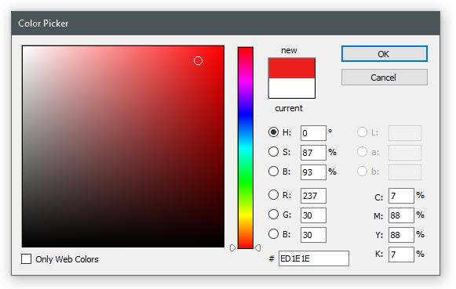

PsColorPicker
=============================================================================

Photoshop-like color picker for .NET. Forked from
https://archive.codeplex.com/?p=pscolorpicker. I didn't change anything,
aside from fixing a bug in the color box.



Usage
-----------------------------------------------------------------------------
```csharp
var color = Color.White;
var form = new OpenPainter.ColorPicker.PsColorPicker(color);

if (form.ShowDialog() == DialogResult.OK)
	color = form.Color;
```
